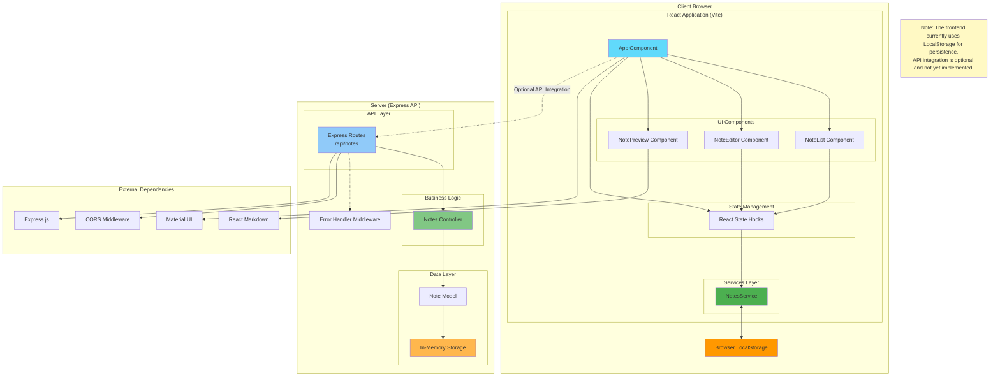
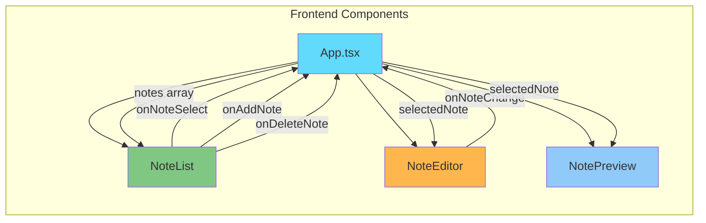
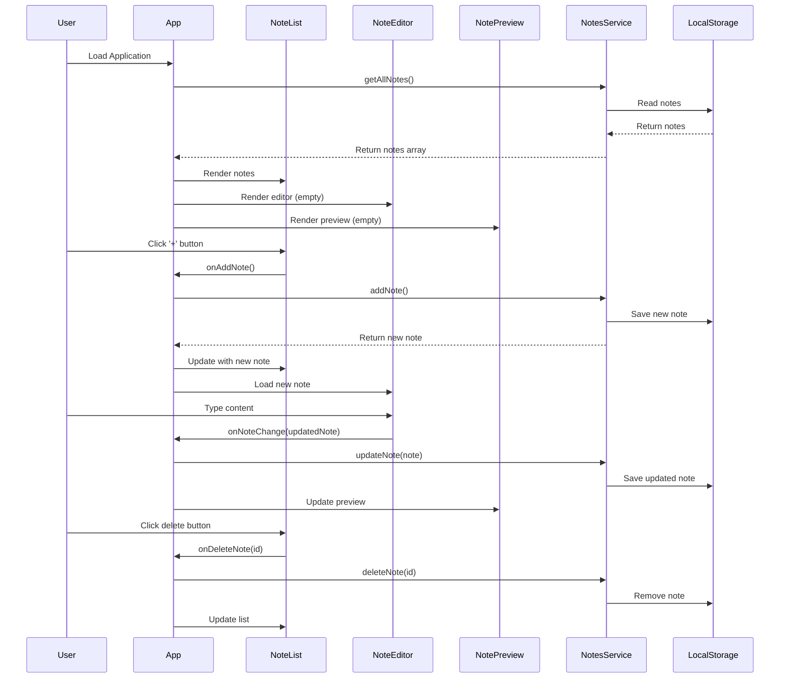
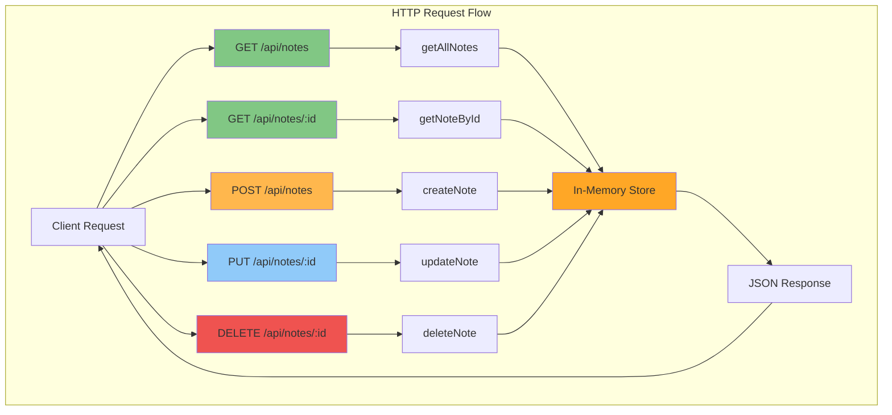
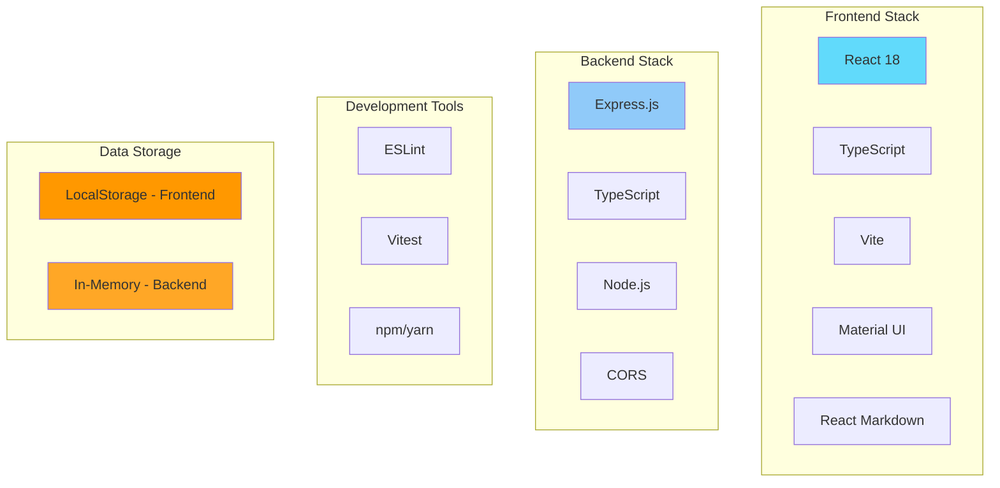

# Notes MD - Architecture Documentation

This document provides an overview of the Notes MD application architecture, including component structure, data flow, and system design.

## System Architecture Diagram

The following diagram provides a high-level overview of the Notes MD application architecture. It shows both the frontend React application and the optional backend Express API, along with their respective components, services, and data storage mechanisms.

## Component Architecture

## Data Flow Diagram

## API Architecture (Optional Backend)

## Technology Stack

## Key Architectural Features

### Frontend Architecture

1. **Component-Based Design**: The UI is divided into reusable React components
   - `App.tsx`: Main application container, manages global state
   - `NoteList.tsx`: Displays list of notes with add/delete functionality
   - `NoteEditor.tsx`: Markdown editor with real-time title extraction
   - `NotePreview.tsx`: Live markdown preview renderer

2. **Service Layer**: `NotesService` encapsulates all data operations
   - CRUD operations for notes
   - LocalStorage persistence
   - Singleton pattern for consistent state

3. **State Management**: React hooks (useState, useEffect)
   - Notes array state
   - Selected note ID state
   - Dark mode theme state

4. **Data Persistence**: Browser LocalStorage
   - Notes stored as JSON
   - Automatic save on all operations
   - Loaded on application initialization

### Backend Architecture (API)

1. **RESTful API Design**: Standard HTTP methods and endpoints
   - GET /api/notes - List all notes
   - GET /api/notes/:id - Get single note
   - POST /api/notes - Create note
   - PUT /api/notes/:id - Update note
   - DELETE /api/notes/:id - Delete note

2. **Layered Architecture**:
   - Routes: Define endpoints and HTTP methods
   - Controllers: Handle business logic
   - Models: Define data structures
   - Middleware: Error handling and CORS

3. **In-Memory Storage**: Notes stored in application memory
   - Simple array-based storage
   - Suitable for development/demo purposes
   - Note: Data is lost on server restart

### Design Patterns

- **Module Pattern**: NotesService is exported as a single instance to ensure consistent state across the application
- **MVC**: API follows Model-View-Controller pattern
- **Component Composition**: React components are composed hierarchically
- **Unidirectional Data Flow**: Props down, events up pattern

### Future Considerations

- Database integration for backend persistence
- Authentication and authorization
- Real-time collaboration features
- API integration for frontend (currently uses LocalStorage)
- File export/import capabilities
- Search and filtering functionality
