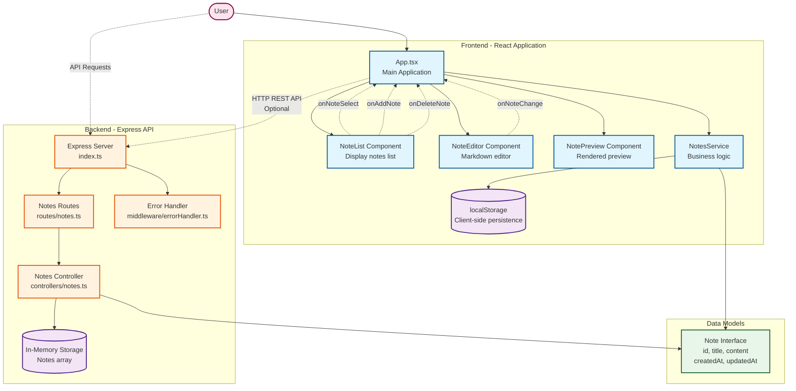

# Notes MD


A web application for taking and managing notes in Markdown format.

## Features

- Create, edit, and delete markdown notes
- Real-time markdown preview
- Automatic note title extraction from content
- Dark mode support
- Local storage for persistence
- Responsive design for various screen sizes
- REST API for serving notes

## Tech Stack

- React
- TypeScript
- Vite
- Material UI
- React Markdown
- Express (REST API)

## Project Structure

- `/web` - Frontend application (React, TypeScript, Vite)
- `/api` - Backend REST API (Express, TypeScript)

## Architecture

The following diagram illustrates the architecture of the Notes MD application:



### Architecture Overview

**Frontend (React/TypeScript/Vite)**
- **App Component**: Main application container that manages state and coordinates child components
- **NoteList Component**: Displays the list of notes with add/delete functionality
- **NoteEditor Component**: Markdown editor with automatic title extraction
- **NotePreview Component**: Real-time markdown rendering using `@uiw/react-markdown-preview`
- **NotesService**: Business logic layer for CRUD operations with localStorage persistence
- **localStorage**: Client-side data persistence for notes

**Backend (Express/TypeScript)**
- **Express Server**: RESTful API server with CORS support
- **Routes Layer**: Defines API endpoints (`GET`, `POST`, `PUT`, `DELETE` for `/api/notes`)
- **Controller Layer**: Handles business logic for note operations
- **Error Handler Middleware**: Centralized error handling
- **In-Memory Storage**: Temporary note storage (can be replaced with a database)

**Data Flow**
- User interactions trigger events in components
- Components communicate with App via callbacks
- App uses NotesService for data operations
- NotesService persists data to localStorage
- API is available for programmatic access (optional integration)
- Both frontend and backend share the same Note interface structure

## Getting Started

### Prerequisites

- Node.js (v14 or higher)
- npm or yarn

### Frontend Installation

1. Clone the repository
   ```
   git clone https://github.com/colbylwilliams/notes-md.git
   cd notes-md
   ```

2. Install dependencies
   ```
   cd web
   npm install
   ```

3. Configure environment variables (optional)
   ```
   cp .env.example .env
   ```
   Modify the `.env` file with your specific configuration.

4. Start the development server
   ```
   npm run dev
   ```

5. Open your browser and navigate to `http://localhost:5173`

### API Installation

1. Install dependencies
   ```
   cd api
   npm install
   ```

2. Configure environment variables
   ```
   cp .env.example .env
   ```
   Modify the `.env` file with your specific configuration.

3. Start the development server
   ```
   npm run dev
   ```

4. The API will be available at `http://localhost:3000`

### Building for Production

```
# Frontend
cd web
npm run build

# API
cd api
npm run build
npm start
```

## Usage

- Click the '+' button to create a new note
- Select a note from the list to edit it
- Write your markdown in the editor
- See the rendered preview in real-time on the right panel
- Use '# Title' at the beginning of your note to set its title
- Use the API endpoints to manage notes programmatically

## Environment Variables

### Frontend

Notes MD supports configuration via environment variables using `.env` files. You can create a `.env` file in the project root to customize your development environment.

Example variables can be found in the `.env.example` file:

| Variable | Description |
| --- | --- |
| `VITE_API_URL` | Base URL for API endpoints |
| `VITE_ENABLE_DARK_MODE_BY_DEFAULT` | Set to 'true' to enable dark mode by default |
| `VITE_ENABLE_AUTOSAVE` | Enable/disable autosave functionality |
| `VITE_APP_TITLE` | Application title |
| `VITE_AUTOSAVE_INTERVAL` | Time interval for autosave in milliseconds |

**Note:** Only variables prefixed with `VITE_` will be exposed to your client-side code.

### API

| Variable | Description |
| --- | --- |
| `PORT` | Port for the API server (default: 3000) |
| `NODE_ENV` | Environment (development, production) |

## License

This project is licensed under the MIT License - see the [LICENSE](LICENSE) file for details.
